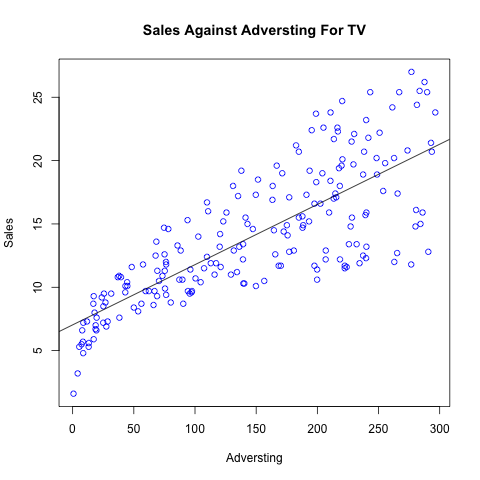

---
title: "Statistics 159 - Homework 2"
author: "Mingtao Fang"
date: "Oct 7th, 2016"
output: 
  html_document:
    fig_height: 3
    fig_width: 5
```{r include=FALSE}
# Don't delete this chunk if you are using the DataComputing package
library(DataComputing)
library(xtable)
```
*Source file* 
```{r, results='asis', echo=FALSE}
includeSourceDocuments()
```
<!-- Don't edit the material above this line -->


##Abstract
In this report we reproduce the main results displayed in section 3.1 Simple Linear Regression (chapter 3) of the book An Introduction to Statistical Learning. We are given a data set of multiple media advertising and the sales unit of a certain product and we are trying to find if possible linear relationship between the variables.

##Introduction
In this project, we are acting as a statistician trying to find out if there is a relationship between TV advertising and the sales performance of our product. We are also trying to interpret the results after running data analysis and generate guide for future advertising strategies.

##Data
The data set we are using in this report is `Advertising.csv`. This data set contains `Sales` as in thousands of untis for a certain product. This data set also contains the budget (in thousands of dollars) for advertising on TV, radio and newspaper. For this report, we are looking at the relationship between Sales and TV only.

##Methodology
We consider one media from the data set, TV, and study its relationship with Sales. For this purpose, we use a simple linear model.

Simple linear regression lives up to its name: it is a very straightforward simple linear
approach for predicting a quantitative response Y on the basis of a sin- regression
gle predictor variable X. It assumes that there is approximately a linear
relationship between X and Y. Mathematically, we can write this linear
relationship as:
                                  Y ≈ β0 + β1X

For example, X may represent TV advertising and Y may represent sales.
Then we can regress sales onto TV by fitting the model
                                  sales ≈ β0 + β1 × TV
To estimate the coefficients β0 and β1 we fit a regression model via the least squares criterion.

##Results

```{r results='asis', echo=FALSE}
load(file = "../data/regression.RData")
s <- summary(regression_object)
table <- xtable(s, caption = "Table 1")
print(table, comment=FALSE)
```

- β_1 hat

From the table above, we can see that the slope coefficient in this model () equals to 7.0325. The coefficient has a positive sign, which means the two variables a positively correlated; The interpretation for this number follows the: for $1,000 increase in TV advertising budget, on average, we expect to bring up 50 units increase in product sales. 

- β_0 hat

The interception coefficient is 0.00475. According to this models, it explains how much the product sales would be when spending on advertising budge equals to zero.

- Hypothesis testing: 

To test the null hypothesis, which states that there is no relationship between advertising budget and product sales, we need to check the p-value. In this case, p-value for both  <0.0001, which incates that it is extremely unlikely to observe no relationship between advertising budget and product sales. Therefore, null hypothesis is rejected, and we should be able to declare a relationship between TV advertising budget and product sales.   

```{r results='asis', echo=FALSE}
table2 <- data.frame(c("Residual standard error", "R Square", "F-Statistics"), c(s$sigma, s$r.squared, s$fstatistic[1]))
colnames(table2) <- c("Quantity", "Value")
table2 <- xtable(table2, caption = "Table2")
print(table2, comment=FALSE)
```
- Residual Standard Error 

The estimated of standard deviation of residuals (RSE) is 3.26, which shows on average, the actual sales in each market will deviate from our regression line by roughly 3,260 units. 
To get the size of this error, we can compare it with the y value, which in this problem, is the mean value of sales over all markets. Since  is about 14,000 units, the RSE is 3260/1400=23% about of average Y value. This should be in an acceptable range. 

- R Sqaure

R Square gives us a better sense of the goodness of fit of this model, since it is scale to the degree of 0<R Square<1, and it is comparible between different data sets. 
In this model, R Sqaure is 0.612, which means 61.2% of the variation we see in Y (sales) can be explained by the change in X (TV advertisement budget). This indicates that the model makes a pretty accurate prediction; To further increase the accuracy of the mode (making R-square smaller), we could potentially take more factors into consideration.



##Conclusions
In this report, we ran a simple linear regression to predict the response of product sales on the basis of the single predictor- TV advertising budget. Base on our regression results, a positive linear relation is detected. The regression function is: predicted product sales increase = 7.0325*money spent on TV advertisement + 0.00475. The model should make good estimations, since 61.2% of variation in Y (product sales increase) that we observe in the sample of size 200 can be explained by the variation in X (money spent on TV advertisement). To increase the accuracy of our prediction, we could add in more factors other than TV advertisement that could potentially affect product sales, for example, price competitiveness, quality of product, customer loyalty etc. 
